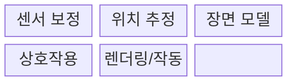
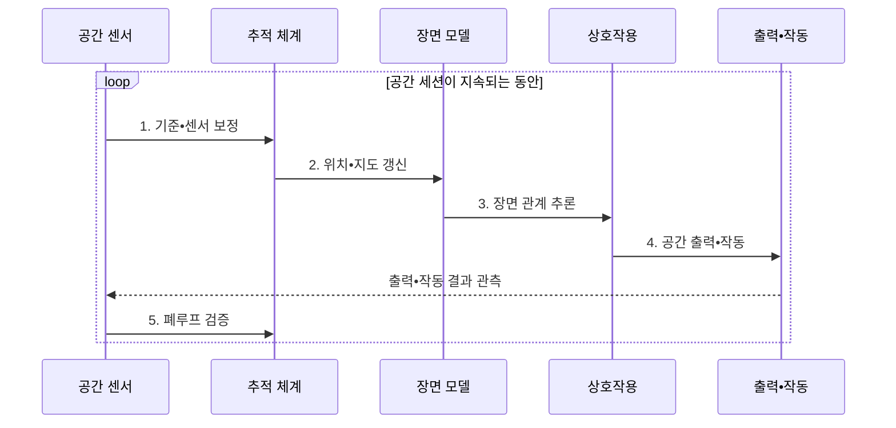

---
sidebar:
  order: 225
  label: "225. 공간 컴퓨팅 (Spatial Computing)"
  badge:
    text: "미출 • 70%"
    variant: note
title: "공간 컴퓨팅 (Spatial Computing)"
date: "2026-08-03T08:48:47+09:00"
tags:
- "notes-latest-tech"
weight: 225
extra:
  question_no: "225"
  source_status: "미출"
  source_history: ""
  priority: 70
  priority_note: "공간 컴퓨팅의 위치•장면 상호작용이 유력함"
---

## Ⅰ. 개요

핵심 용어

- **공간 컴퓨팅(Spatial Computing)**: 센서로 물리 환경과 기기의 위치를 인식하고 디지털 정보•사용자 입력•기기 동작을 실제 공간 좌표에 정합하는 컴퓨팅 방식이다.

- 정의/개념: **공간 컴퓨팅(Spatial Computing)** 은 물리 환경을 인식해 디지털 정보와 사용자•기기 동작을 실제 공간 좌표에 정합하는 컴퓨팅 방식
- 배경/필요성: 평면 화면은 사용자•사물의 **공간 관계 기반 상호작용 불가**

#### 한줄 요약

- 물리 공간을 인식해 디지털 정보와 기기 동작을 실제 좌표에 정합한다.

## Ⅱ. 특징

핵심 용어

- **공간 정합**: 가상 객체의 위치•크기•방향을 인식한 물리 공간의 좌표와 일치시키는 과정이다.

- 시각•관성•**광 검출 및 거리 측정(Light Detection and Ranging, LiDAR)** 센서의 **시간•좌표 정렬**
- **동시적 위치 추정 및 지도 작성(Simultaneous Localization and Mapping, SLAM)** 으로 **장치 위치•환경 지도** 동시 갱신
- 객체•가림•통행 영역의 **공간 맥락 추론**
#### 한줄 요약

- 센서를 정렬하고 위치•지도를 갱신해 공간 맥락에 맞는 출력과 동작을 수행한다.

## Ⅲ. 구조 및 구성요소

핵심 용어

- **동시적 위치 추정 및 지도 작성(SLAM)**: 센서 데이터로 주변 지도를 생성하면서 그 지도 안에서 기기의 위치를 동시에 추정하는 기술이다.
- **센서 보정•융합**: 카메라•관성•라이다의 좌표•시간•오차를 맞춰 일관된 공간 관측을 만드는 과정이다.
- **장면 모델**: 표면•깊이•객체•의미•가림 관계를 현실 좌표계에 표현한 디지털 공간 지도이다.
- **공간 상호작용**: 시선•손•음성•컨트롤러 입력을 현실 공간의 객체와 행위에 연결하는 기능이다.
- **렌더링•작동**: 추적된 시점에 맞춰 가상 내용을 정합하게 표시하거나 로봇•장치를 공간 좌표로 제어한다.

카메라•관성•**광 검출 및 거리 측정(Light Detection and Ranging, LiDAR)** 센서를 보정하고 **동시적 위치 추정 및 지도 작성(Simultaneous Localization and Mapping, SLAM)** 으로 위치와 장면 모델을 갱신한다.

| 구성요소 | 책임 |
|:---|:---|
| 센서 보정 | **카메라•관성•LiDAR 좌표** 동기화 |
| 위치 추정 | **장치 자세•환경 지도** 생성 |
| 장면 모델 | **객체•평면•공간 앵커** 관리 |
| 상호작용 | **손•시선•음성 입력** 을 공간 객체와 연결 |
| 렌더링/작동 | **가상 표현•물리 제어** 수행 |

#### 한줄 요약

- 센서를 보정해 지도와 장면 의미를 만들고 렌더링 또는 물리 동작으로 출력한다.

## Ⅳ. 흐름도

핵심 용어

- **공간 앵커**: 가상 콘텐츠를 실제 공간의 특정 좌표나 사물에 지속적으로 고정하는 기준점이다.

**동작 원리**

1. **기준•센서 보정**: 카메라•관성•깊이 센서 시간•좌표 정렬
2. **위치•지도 갱신**: **동시적 위치 추정 및 지도 작성(Simultaneous Localization and Mapping, SLAM)** 기반 자세•환경 지도 추정
3. **장면 관계 추론**: 평면•객체•가림•공간 앵커 식별
4. **공간 출력•작동**: 공간 입력 기반 렌더링•물리 제어
5. **폐루프 검증**: 드리프트•지연 보정 또는 안전 정지

#### 한줄 요약

- 장치와 사물이 움직일 때마다 위치•지도를 갱신해 출력과 동작을 다시 정합한다.

## Ⅴ. 종류 및 비교

핵심 용어

- **확장현실(XR)**: 가상현실•증강현실•혼합현실을 포괄하여 현실과 가상 정보의 결합 수준을 나타내는 기술 범주다.

| 판단 기준 | 증강현실(Augmented Reality, AR) 인터페이스 | 공간 컴퓨팅 | 로보틱스 |
|:---|:---|:---|:---|
| 핵심 특징 | **현실 시야에 정보 정렬** | **공간 모델•입력•작동 연결** | **물리 환경 과업 수행** |
| 적용 기준 | **안내•시각화•원격 지원** | **공간 이해형 확장현실(Extended Reality, XR)•제어** | **이동•조작•자율 작업** |
| 주요 위험 | **가림•드리프트•사용자 피로** | **좌표 오차•프라이버시** | **충돌•제어 실패•현실 피해** |

> 요약: **AR** 은 시각 정렬, **공간 컴퓨팅** 은 공간 이해•상호작용 연결

#### 한줄 요약

- 증강현실은 시각 정보를 정렬하고 공간 컴퓨팅은 공간 모델•입력•작동을 연결한다.

## Ⅵ. 실무 고려사항 및 대책

핵심 용어

- **드리프트**: 센서 오차가 누적되어 디지털 객체가 고정된 물리 좌표에서 점차 벗어나는 위치 추정 오류다.

| 문제 | 대책 | 효과 |
|:---|:---|:---|
| 드리프트•지연으로 **공간 오조작** | **앵커 재관측•정합 임계값** 적용 | **공간 정합성** 유지 |
| 장면 오인식으로 **위험한 물리 동작 실행** | **다중 센서 검증•사람 승인** | **위험 동작•현실 피해** 감소 |
| 공간 지도 수집으로 **개인정보 노출** | **기기 내 처리•지도 암호화** | **공간 지도 노출 범위** 축소 |

#### 한줄 요약

- 핵심 운영 위험마다 실행 가능한 대책과 검증 효과를 함께 확인한다.

## Ⅶ. 결론

핵심 용어

- **광 검출 및 거리 측정(LiDAR)**: 레이저 펄스의 왕복 시간을 측정하여 물체까지의 거리와 3차원 깊이 정보를 얻는 센서다.

- 시각 정보 정렬은 **증강현실(Augmented Reality, AR)**, 공간 이해•입력•작동 연결은 **공간 컴퓨팅** 선택

#### 한줄 요약

- 공간 정합의 정확도•지속성과 오인식 시 안전 정지가 핵심이다.
