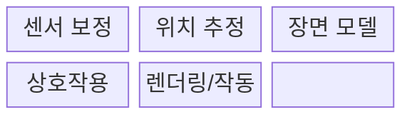
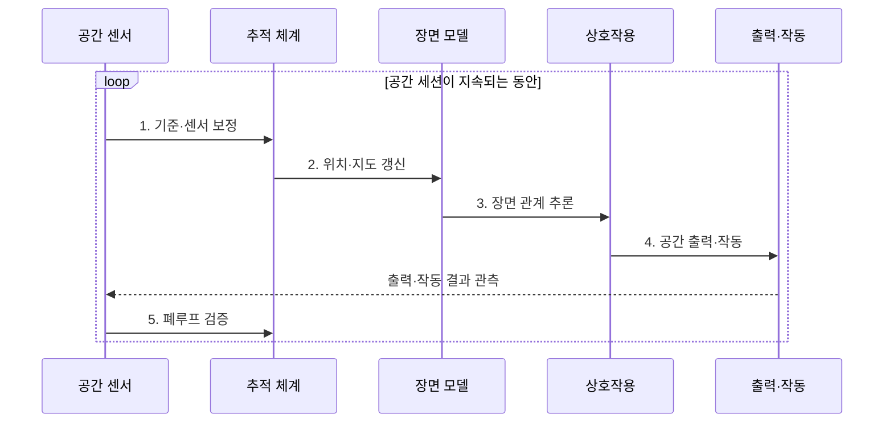

---
sidebar:
  order: 225
  label: "225. 공간 컴퓨팅 (Spatial Computing)"
  badge:
    text: "미출 · 70%"
    variant: note
title: "공간 컴퓨팅 (Spatial Computing)"
date: "2026-07-31T12:13:23+09:00"
tags:
- "notes-latest-tech"
weight: 225
extra:
  question_no: "225"
  source_status: "미출"
  source_history: ""
  priority: 70
  priority_note: "공간 컴퓨팅의 위치·장면 상호작용이 유력함"
---

## 미리 알고가기

- **공간 컴퓨팅(Spatial Computing)**: 화면 속 가상 정보와 실제 물리 공간을 결합하여, 사용자의 주변 환경 자체를 컴퓨터 입력 및 인터페이스로 활용하는 기술임
- **공간 앵커(Spatial Anchor)**: 가상의 3D 콘텐츠를 실제 현실 공간의 특정 좌표 및 사물에 물리적으로 흔들림 없이 고정하기 위해 사용하는 기준점임
- **드리프트(Drift)**: 센서의 누적 오차로 인해 디지털 객체가 고정된 물리 좌표에서 벗어나 조금씩 이동하거나 흔들리는 위치 추정 오류 현상임
- **SLAM(Simultaneous Localization and Mapping)**: 센서 데이터를 기반으로 주변 환경의 디지털 지도를 생성하는 동시에, 기기의 위치를 실시간으로 추정하는 기술임
- **LiDAR(Light Detection and Ranging)**: 레이저 펄스를 발사하고 반사되어 돌아오는 시간을 측정하여, 정밀한 3D 공간의 깊이 정보와 거리를 계산하는 센서임
- **확장현실(Extended Reality, XR)**: 가상현실·증강현실·혼합현실을 포괄함

## Ⅰ. 개요

- 정의/개념: 디지털 정보와 사용자·기기 동작을 물리 공간 좌표에 정합하는 **공간 컴퓨팅**
- 배경/필요성: 평면 화면은 사용자·사물의 **공간 관계 기반 상호작용 불가**

### 쉽게 이해하기 (학습용)

- 컴퓨터가 현실 환경을 이해해 그 자리에 디지털 정보를 배치하거나 물리적인 기기 동작을 맞추는 기술

## Ⅱ. 특징

- 시각·관성·LiDAR 센서의 **시간·좌표 정렬**
- SLAM으로 **장치 위치·환경 지도** 동시 갱신
- 객체·가림·통행 영역의 **공간 맥락 추론**
### 쉽게 이해하기 (학습용)

- 센서로 방을 보고 내 위치를 찾은 뒤 책상이라는 의미를 알아내 그 위에 버튼을 띄우거나 로봇 팔이 물건을 집게 함

## Ⅲ. 구조 및 구성요소

| 구성요소 | 책임 |
|:---|:---|
| 센서 보정 | **카메라·관성·LiDAR 좌표** 동기화 |
| 위치 추정 | **장치 자세·환경 지도** 생성 |
| 장면 모델 | **객체·평면·공간 앵커** 관리 |
| 상호작용 | **손·시선·음성 입력**을 공간 객체와 연결 |
| 렌더링/작동 | **가상 표현·물리 제어** 수행 |

### 쉽게 이해하기 (학습용)

- 카메라와 움직임 센서의 시간을 맞춘 뒤 지도를 만들고 사물 의미를 붙여 사람이 볼 화면이나 로봇의 행동으로 바꿈

## Ⅳ. 흐름도

**동작 원리**

1. **기준·센서 보정**: 카메라·관성·깊이 센서 시간·좌표 정렬
2. **위치·지도 갱신**: SLAM 기반 자세·환경 지도 추정
3. **장면 관계 추론**: 평면·객체·가림·공간 앵커 식별
4. **공간 출력·작동**: 공간 입력 기반 렌더링·물리 제어
5. **폐루프 검증**: 드리프트·지연 보정 또는 안전 정지

### 쉽게 이해하기 (학습용)

- 한 번 방을 스캔하고 끝내지 않고 내가 움직이고 가구가 옮겨질 때마다 지도를 고쳐 정보와 행동 위치를 다시 맞춤

## Ⅴ. 종류 및 비교

| 판단 기준 | AR 인터페이스 | 공간 컴퓨팅 | 로보틱스 |
|:---|:---|:---|:---|
| 핵심 특징 | **현실 시야에 정보 정렬** | **공간 모델·입력·작동 연결** | **물리 환경 과업 수행** |
| 적용 기준 | **안내·시각화·원격 지원** | **공간 이해형 XR·제어** | **이동·조작·자율 작업** |
| 주요 위험 | **가림·드리프트·사용자 피로** | **좌표 오차·프라이버시** | **충돌·제어 실패·현실 피해** |

> 요약: **AR**은 시각 정렬, **공간 컴퓨팅**은 공간 이해·상호작용 연결

### 쉽게 이해하기 (학습용)

- 공간 컴퓨팅이 방의 지도와 물건 위치를 이해하면 AR 안경은 그 위에 화살표를 그리고 로봇은 그 위치로 가서 물건을 집음

## Ⅵ. 실무 고려사항 및 대책

| 고려사항 | 대책 | 효과 |
|:---|:---|:---|
| 드리프트·지연으로 **공간 오조작** | **앵커 재관측·정합 임계값** 적용 | **공간 정합성** 유지 |
| 장면 오인식으로 **위험한 물리 동작 실행** | **다중 센서 검증·사람 승인** | **위험 동작·현실 피해** 감소 |
| 공간 지도 수집으로 **개인정보 노출** | **기기 내 처리·지도 암호화** | **공간 지도 노출 범위** 축소 |

### 쉽게 이해하기 (학습용)

- 핵심 운영 위험마다 실행 가능한 대책과 검증 효과를 함께 확인한다.

## Ⅶ. 결론

- 시각 정보 정렬은 **AR**, 공간 이해·입력·작동 연결은 **공간 컴퓨팅** 선택

### 쉽게 이해하기 (학습용)

- 정보가 멋지게 보이는 것보다 실제 물건의 정확한 자리에 오래 붙어 있고 잘못 알았을 때 안전하게 멈추는지가 핵심임
