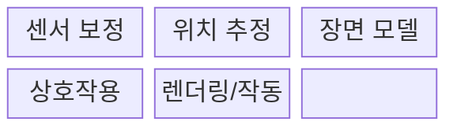
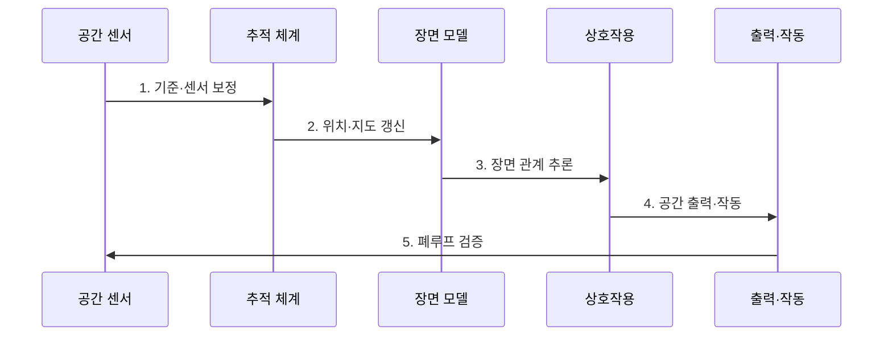

---
sidebar:
  order: 225
  label: "225. 공간 컴퓨팅 (Spatial Computing)"
  badge:
    text: "미출 · 70%"
    variant: note
title: "공간 컴퓨팅 (Spatial Computing)"
date: "2026-07-30T20:20:00+09:00"
tags:
- "notes-latest-tech"
weight: 225
extra:
  question_no: "225"
  source_status: "미출"
  source_history: ""
  priority: 70
  priority_note: "공간 컴퓨팅의 위치·장면 상호작용이 유력함"
---

## 미리 알고가기

- **공간 컴퓨팅(Spatial Computing)**: 화면 속 가상 정보와 실제 물리 공간을 결합하여, 사용자의 주변 환경 자체를 컴퓨터 입력 및 인터페이스로 활용하는 기술임
- **공간 앵커(Spatial Anchor)**: 가상의 3D 콘텐츠를 실제 현실 공간의 특정 좌표 및 사물에 물리적으로 흔들림 없이 고정하기 위해 사용하는 기준점임
- **드리프트(Drift)**: 센서의 누적 오차로 인해 디지털 객체가 고정된 물리 좌표에서 벗어나 조금씩 이동하거나 흔들리는 위치 추정 오류 현상임
- **SLAM(Simultaneous Localization and Mapping)**: 센서 데이터를 기반으로 주변 환경의 디지털 지도를 생성하는 동시에, 기기의 위치를 실시간으로 추정하는 기술임
- **LiDAR(Light Detection and Ranging)**: 레이저 펄스를 발사하고 반사되어 돌아오는 시간을 측정하여, 정밀한 3D 공간의 깊이 정보와 거리를 계산하는 센서임
- **확장현실(Extended Reality, XR)**: 가상현실·증강현실·혼합현실을 포괄함

## Ⅰ. 개요

- 정의/개념: 디지털 정보·동작을 물리 좌표에 연결
- 배경/필요성: 평면 화면 중심 인터페이스는 사용자의 위치와 실제 사물의 공간 관계를 반영한 직관적 상호작용을 제공하기 어렵다.

### 쉽게 이해하기 (학습용)

- 컴퓨터가 현실 환경을 이해해 그 자리에 디지털 정보를 배치하거나 물리적인 기기 동작을 맞추는 기술

## Ⅱ. 특징

- **1. 센서 보정**: 시각·관성 센서와 좌표계의 공간 오차 축소
- **2. SLAM**: 장치 위치 추정과 환경 지도 생성을 동시에 갱신
- **3. 장면 이해**: 객체·가림·통행 가능 영역의 공간 맥락 추론
### 쉽게 이해하기 (학습용)

- 센서로 방을 보고 내 위치를 찾은 뒤 책상이라는 의미를 알아내 그 위에 버튼을 띄우거나 로봇 팔이 물건을 집게 함

## Ⅲ. 구조 및 구성요소

| 구성요소 | 책임 |
|:---|:---|
| 센서 보정 | 센서 시간·좌표를 동기화함 |
| 위치 추정 | 장치 위치와 환경 지도를 생성함 |
| 장면 모델 | 객체·평면·앵커를 관리함 |
| 상호작용 | 입력을 공간 객체와 연결함 |
| 렌더링/작동 | 가상 표현·물리 제어를 수행함 |

### 쉽게 이해하기 (학습용)

- 카메라와 움직임 센서의 시간을 맞춘 뒤 지도를 만들고 사물 의미를 붙여 사람이 볼 화면이나 로봇의 행동으로 바꿈

## Ⅳ. 흐름도

**동작 원리**

- **1. 기준·센서 보정**: 카메라·관성·깊이 센서의 시간과 좌표계 정렬
- **2. 위치·지도 갱신**: SLAM으로 장치 자세와 환경 지도를 동시에 추정
- **3. 장면 관계 추론**: 평면·객체·가림·통행 영역과 공간 앵커 식별
- **4. 공간 출력·작동**: 손·시선·음성 입력을 객체에 연결해 렌더링·물리 제어
- **5. 폐루프 검증**: 결과를 재관측해 드리프트·지연·오작동을 보정하거나 안전 정지

### 쉽게 이해하기 (학습용)

- 한 번 방을 스캔하고 끝내지 않고 내가 움직이고 가구가 옮겨질 때마다 지도를 고쳐 정보와 행동 위치를 다시 맞춤

## Ⅴ. 종류 및 비교

| 판단 기준 | AR 인터페이스 | 공간 컴퓨팅 | 로보틱스 |
|:---|:---|:---|:---|
| 핵심 특징 | 현실 시야에 디지털 정보 정렬 | 공간 모델로 표현·입력·작동 연결 | 물리 장치가 환경에서 과업 수행 |
| 적용 기준 | 안내·시각화·원격 지원 | 공간 이해가 필요한 XR·제어 | 이동·조작·자율 작업 |
| 주요 위험 | 가림·drift·사용자 피로 | 좌표 오차·privacy·오작동 | 충돌·제어 실패·현실 피해 |

### 쉽게 이해하기 (학습용)

- 공간 컴퓨팅이 방의 지도와 물건 위치를 이해하면 AR 안경은 그 위에 화살표를 그리고 로봇은 그 위치로 가서 물건을 집음

## Ⅵ. 실무 고려사항 및 대책

| 고려사항 | 대책 | 효과 |
|:---|:---|:---|
| **드리프트·지연** 미검증 시 정보가 실제 대상과 어긋나 오조작 | 앵커 재관측, 지연 예산, 정합 오차 임계값과 표시 중단 | 현실 대상과 오버레이의 **공간 정합성** 유지 |
| **장면 오인식** 미검증 시 사람·장애물·작업 영역을 잘못 추론 | 신뢰도 표시, 다중 센서 검증, 위험 동작의 사람 승인 | 장면 오인식의 **위험 동작 전파** 차단 |
| **공간 개인정보** 미검증 시 실내 구조·사람·행동 정보 노출 | 기기 내 최소 처리, 공간 지도 암호화, 목적별 보존·공유 통제 | 공간 지도·행동 정보의 **노출 범위** 축소 |

### 쉽게 이해하기 (학습용)

- 핵심 운영 위험마다 실행 가능한 대책과 검증 효과를 함께 확인한다.

## Ⅶ. 결론

- 현실 공간과 디지털 정보를 정확하게 결합하기 위해 **공간 정합성·추적 지연·사용자 안전·개인정보·안전 정지 요구**를 검토하고, 용도에 맞는 공간 표현과 상호작용 방식을 선택해야 한다.

### 쉽게 이해하기 (학습용)

- 정보가 멋지게 보이는 것보다 실제 물건의 정확한 자리에 오래 붙어 있고 잘못 알았을 때 안전하게 멈추는지가 핵심임
