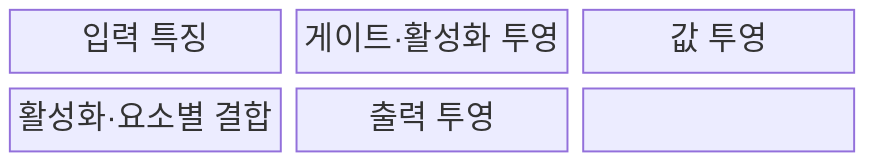
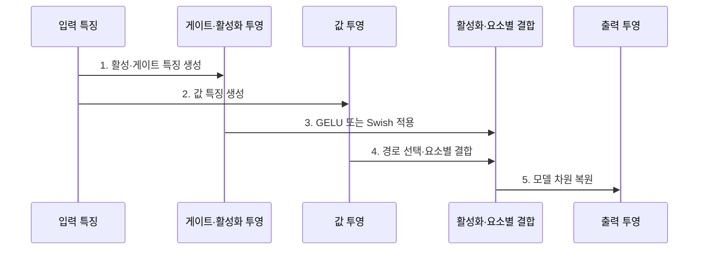

---
sidebar:
  order: 226
  label: "226. SwiGLU·GELU 활성화 함수 비교"
  badge:
    text: "미출 · 50%"
    variant: note
title: "SwiGLU·GELU 활성화 함수 비교 (Activation Functions)"
date: "2026-07-25T03:55:00+09:00"
tags:
  - "notes-latest-tech"
weight: 226
extra:
  question_no: "226"
  source_status: "미출"
  source_history: ""
  priority: 50
  priority_note: "LLM 피드포워드 활성화·연산량 선택"
---

## 미리 알고가기

- **활성화 함수(Activation Function)**: 신경망에 비선형성을 더해 복잡한 입력 관계를 학습하게 하는 함수
- **GELU(Gaussian Error Linear Unit)**: 입력 크기에 따라 값을 부드럽게 통과시키거나 억제하는 활성화 함수
- **GLU(Gated Linear Unit)**: 한 투영값을 다른 투영값의 게이트로 조절하는 구조
- **SwiGLU(Swish-Gated Linear Unit)**: Swish 계열 게이트와 선형 투영을 결합한 GLU 변형
- **피드포워드 네트워크(Feed-Forward Network, FFN)**: Transformer 블록에서 토큰별 특징을 변환하는 계층
- **은닉 차원(Hidden Dimension)**: FFN 내부 투영 벡터의 폭
- **파라미터 예산(Parameter Budget)**: 모델 크기·메모리·연산량에 허용된 가중치 규모

## Ⅰ. 개요

- 정의/개념: Transformer FFN의 **GELU 단일 활성 경로**와 **SwiGLU 게이트·값 이중 경로** 비교
- 배경/필요성: 게이트 기반 표현력과 추가 투영에서 발생하는 **파라미터·연산·메모리 비용**의 균형

### 쉽게 이해하기 (학습용)

- GELU는 신호를 부드럽게 거르고 SwiGLU는 별도 문지기가 신호 통과량을 조절한다.

## Ⅱ. 특징

- **1. SwiGLU 게이팅**: 입력별 특징 선택을 강화하는 곱셈 게이트
- **2. GELU 단일 경로**: 단순한 투영 구조로 구현·메모리 비용 절감
- **3. FFN 삼중 투영**: SwiGLU의 추가 행렬에 따른 파라미터 비용 증가
### 쉽게 이해하기 (학습용)

- 문지기를 하나 더 두면 선택은 정교해지지만 같은 공간을 쓰려면 통로 폭을 줄여야 한다.

## Ⅲ. 구조 및 구성요소

| 구성요소 | 책임 |
|:---|:---|
| 입력 특징 | Transformer 토큰별 모델 차원 입력 |
| 게이트·활성화 투영 | GELU 활성값 또는 Swish 게이트 생성 |
| 값 투영 | SwiGLU에서 게이트와 결합할 선형 특징 생성 |
| 활성화·요소별 결합 | GELU 단일 경로 또는 SwiGLU 게이트×값 계산 |
| 출력 투영 | 활성 특징을 모델 차원으로 복원 |

### 쉽게 이해하기 (학습용)

- GELU는 한 통로를 거치고 SwiGLU는 값 통로와 문지기 통로를 합쳐 출력한다.

## Ⅳ. 흐름도

**동작 원리**

- **1. 활성·게이트 특징 생성**: 입력을 투영해 GELU 입력 또는 Swish 게이트 계산
- **2. 값 특징 생성**: SwiGLU는 독립 선형 투영으로 값 경로 생성
- **3. GELU 또는 Swish 적용**: GELU는 확률적 게이팅 형태, SwiGLU는 Swish 계열 게이트 적용
- **4. 경로 선택·요소별 결합**: GELU는 활성값을 전달하고 SwiGLU는 게이트와 값 투영을 곱함
- **5. 모델 차원 복원**: 내부 특징을 출력 투영으로 원래 모델 차원에 반환

### 쉽게 이해하기 (학습용)

- GELU는 각 신호 자체를 보고 거르고 SwiGLU는 다른 신호가 만든 문으로 통과량을 정한다.

## Ⅴ. 종류 및 비교

| FFN 활성화 방식 | SwiGLU | GELU |
|:---|:---|:---|
| 적용 기준 | 품질 우선 LLM FFN·예산 조정 가능 | 단순 경로·호환성·비용 우선 |
| 핵심 특징 | 게이트·값 투영의 요소별 결합 | 단일 투영값의 부드러운 활성화 |
| 한계 | 투영 증가·메모리·연산량 확대 | 게이트 기반 특징 선택 부재 |

### 쉽게 이해하기 (학습용)

- 더 정교한 문지기가 필요하면 SwiGLU, 단순하고 널리 맞는 통로가 필요하면 GELU를 고른다.

## Ⅵ. 실무 고려사항 및 대책

| 고려사항 | 대책 | 효과 |
|:---|:---|:---|
| 서로 다른 파라미터 수로 품질 비교 왜곡 | 전체 FFN 파라미터 예산에 맞춰 내부 폭 조정 | 공정한 품질·비용 비교 |
| 추가 투영의 메모리 대역폭 증가 | 연산 융합 커널·텐서 병렬 배치 검증 | 추론 지연·메모리 이동 감소 |
| 모델·하드웨어별 이득 편차 | 동일 데이터·학습량·정밀도에서 A/B 측정 | 실제 환경의 선택 근거 확보 |

### 쉽게 이해하기 (학습용)

- 언어 모델은 문지기 통로를 추가하는 대신 내부 폭을 줄여 전체 크기를 맞춘다.

## Ⅶ. 결론

- Transformer FFN의 품질과 추론 효율을 최적화하기 위해 **모델 정확도·파라미터 및 연산량·메모리·가속기 커널 지원**을 검토하고, 품질 이득이 비용을 정당화하면 SwiGLU, 단순성과 호환성이 중요하면 GELU를 선택해야 한다.

### 쉽게 이해하기 (학습용)

- 품질 이득이 추가 통로 비용을 넘고 커널이 받쳐 주는지 보고 활성화를 정한다.
