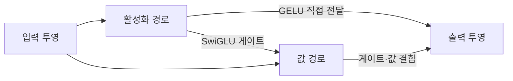
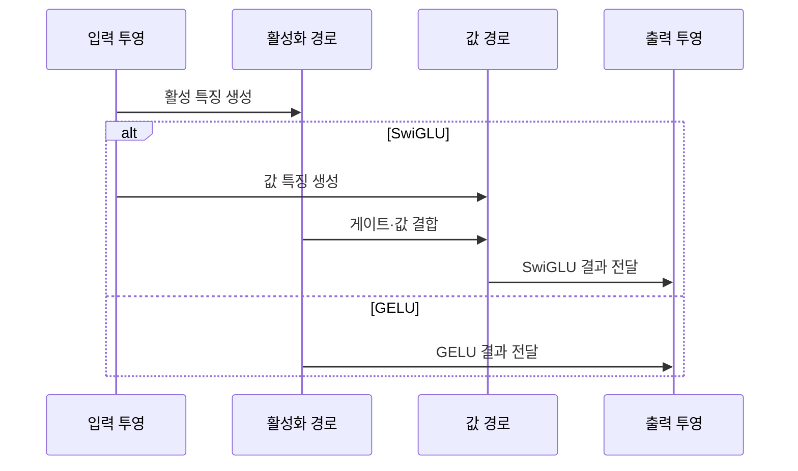

---
sidebar:
  order: 226
  label: "226. SwiGLU·GELU 활성화 함수 비교"
  badge:
    text: "미출제 · 50%"
    variant: note
title: "SwiGLU·GELU 활성화 함수 비교 (Activation Functions)"
date: "2026-07-25T03:55:00+09:00"
tags:
  - "notes-latest-tech"
weight: 226
extra:
  question_no: "226"
  source_status: "미출제"
  source_history: ""
  priority: 50
  priority_note: "LLM 피드포워드 활성화·연산량 선택"
---

## 미리 알고가기

- **활성화 함수(Activation Function)**: 신경망에 비선형성을 더해 복잡한 입력 관계를 학습하게 하는 함수
- **GELU(Gaussian Error Linear Unit)**: 입력 크기에 따라 값을 부드럽게 통과시키거나 억제하는 활성화 함수
- **GLU(Gated Linear Unit)**: 한 투영값을 다른 투영값의 게이트로 조절하는 구조
- **SwiGLU(Swish-Gated Linear Unit)**: Swish 계열 게이트와 선형 투영을 결합한 GLU 변형
- **피드포워드 네트워크(Feed-Forward Network, FFN)**: Transformer 블록에서 토큰별 특징을 변환하는 계층
- **은닉 차원(Hidden Dimension)**: FFN 내부 투영 벡터의 폭
- **파라미터 예산(Parameter Budget)**: 모델 크기·메모리·연산량에 허용된 가중치 규모

## Ⅰ. 개요

- 정의/개념: SwiGLU 게이트와 GELU 활성화의 FFN 비교
- 기존 한계: 단순 활성화 함수만으로는 Transformer FFN의 표현력을 높이는 데 한계가 있고, 게이트 구조는 품질 향상과 함께 파라미터·연산 비용을 증가시킨다.

### 쉽게 이해하기 (학습용)

- GELU는 신호를 부드럽게 거르고 SwiGLU는 별도 문지기가 신호 통과량을 조절한다.

## Ⅱ. 특징

- SwiGLU 게이트가 입력별 특징 선택을 강화한다.
- GELU 단일 경로가 구현·메모리 비용을 줄인다.
- SwiGLU는 보통 FFN 투영 행렬을 하나 더 쓴다.
- 동일 예산 비교는 은닉 차원 재조정이 필요하다.

### 쉽게 이해하기 (학습용)

- 문지기를 하나 더 두면 선택은 정교해지지만 같은 공간을 쓰려면 통로 폭을 줄여야 한다.

## Ⅲ. 아키텍처 및 구성요소

| 설계 요소 | 설명 |
|:---|:---|
| 입력 투영 | FFN 입력을 내부 특징으로 변환 |
| 활성화 경로 | GELU 변환 또는 SwiGLU 게이트 생성 |
| 값 경로 | SwiGLU에서 결합할 선형 특징 생성 |
| 출력 투영 | 활성 특징을 모델 차원으로 복원 |

> 요약: 활성화·값 경로 구성이 두 방식의 경계

### 쉽게 이해하기 (학습용)

- GELU는 한 통로를 거치고 SwiGLU는 값 통로와 문지기 통로를 합쳐 출력한다.

## Ⅳ. 원리 및 절차 흐름도

| 절차 | 설명 |
|:---|:---|
| 활성 특징 생성 | GELU 활성값 또는 SwiGLU 게이트 생성 |
| 값 특징 생성 | SwiGLU 결합용 선형 특징 생성 |
| 게이트·값 결합 | 게이트로 값 특징의 통과량 조절 |
| SwiGLU 결과 전달 | 결합 결과를 다음 계층 차원으로 투영 |
| GELU 결과 전달 | 활성 결과를 다음 계층 차원으로 투영 |

> 요약: 단일 활성화와 입력 의존 게이트의 차이

### 쉽게 이해하기 (학습용)

- GELU는 각 신호 자체를 보고 거르고 SwiGLU는 다른 신호가 만든 문으로 통과량을 정한다.

## Ⅴ. 종류 및 비교

| 판단 기준 | SwiGLU | GELU |
|:---|:---|:---|
| 핵심 특징 | 게이트·값 투영의 요소별 결합 | 단일 투영값의 부드러운 활성화 |
| 적용 기준 | 품질 우선 LLM FFN·예산 조정 가능 | 단순 경로·호환성·비용 우선 |
| 주요 위험 | 투영 증가·메모리·연산량 확대 | 게이트 기반 특징 선택 부재 |

> 요약: 품질·예산은 SwiGLU, 단순성은 GELU

### 쉽게 이해하기 (학습용)

- 더 정교한 문지기가 필요하면 SwiGLU, 단순하고 널리 맞는 통로가 필요하면 GELU를 고른다.

## Ⅵ. 실무 사례

1. 대규모 언어 모델: 파라미터 예산에 맞춰 SwiGLU 폭 조정

### 쉽게 이해하기 (학습용)

- 언어 모델은 문지기 통로를 추가하는 대신 내부 폭을 줄여 전체 크기를 맞춘다.

## Ⅶ. 결론

- Transformer FFN의 품질과 추론 효율을 최적화하기 위해 **모델 정확도·파라미터 및 연산량·메모리·가속기 커널 지원**을 검토하고, 품질 이득이 비용을 정당화하면 SwiGLU, 단순성과 호환성이 중요하면 GELU를 선택해야 한다.

### 쉽게 이해하기 (학습용)

- 품질 이득이 추가 통로 비용을 넘고 커널이 받쳐 주는지 보고 활성화를 정한다.
