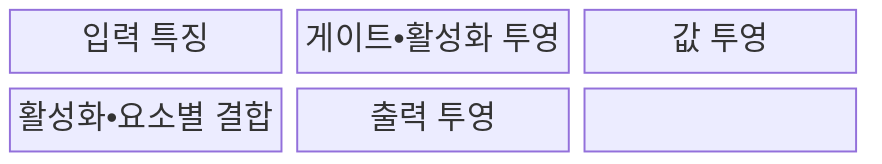
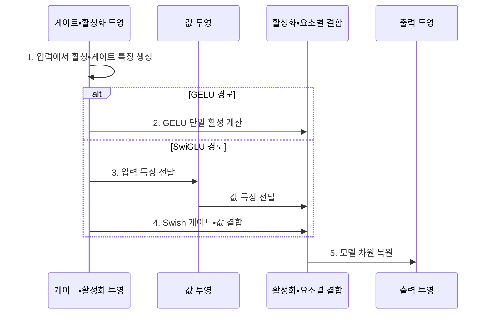

---
sidebar:
  order: 226
  label: "226. SwiGLU•GELU 활성화 함수 비교"
  badge:
    text: "미출 • 50%"
    variant: note
title: "SwiGLU•GELU 활성화 함수 비교 (Activation Functions)"
date: "2026-08-03T08:48:47+09:00"
tags:
  - "notes-latest-tech"
weight: 226
extra:
  question_no: "226"
  source_status: "미출"
  source_history: ""
  priority: 50
  priority_note: "LLM 피드포워드 활성화•연산량 선택"
---

## Ⅰ. 개요

핵심 용어

- **GELU와 SwiGLU 비교**: 트랜스포머의 피드포워드 신경망에서 단일 비선형 활성과 곱셈 게이트 구조를 표현력•파라미터•연산량 기준으로 선택하는 설계 문제다.

- 정의/개념: **가우시안 오류 선형 유닛(Gaussian Error Linear Unit, GELU)과 스위시 게이트 선형 유닛(Swish Gated Linear Unit, SwiGLU) 비교** 는 트랜스포머(Transformer) **피드포워드 신경망(Feed-Forward Network, FFN)** 에서 단일 활성과 게이트•값 결합을 표현력•파라미터•연산량 기준으로 선택하는 설계 문제
- 배경/필요성: GELU 단일 활성 경로는 입력별 **곱셈 게이팅 불가**

#### 한줄 요약

- GELU는 신호를 부드럽게 거르고 SwiGLU는 별도 문지기가 신호 통과량을 조절한다.

## Ⅱ. 특징

핵심 용어

- **가우시안 오류 선형 유닛(GELU)**: 입력에 표준 정규분포 누적분포함수 값을 곱해 음수는 부드럽게 억제하고 양수는 통과시키는 결정적 활성화 함수다.

- **스위시 게이트 선형 유닛(Swish Gated Linear Unit, SwiGLU)** 의 **곱셈 게이트** 로 입력별 특징 선택
- **가우시안 오류 선형 유닛(Gaussian Error Linear Unit, GELU)** 의 **단일 활성 경로** 로 구현•메모리 절감
- 같은 은닉 차원에서는 SwiGLU의 **삼중 투영**으로 파라미터•연산 증가
#### 한줄 요약

- 문지기를 하나 더 두면 선택은 정교해지지만 같은 공간을 쓰려면 통로 폭을 줄여야 한다.

## Ⅲ. 구조 및 구성요소

핵심 용어

- **스위시 게이트 선형 유닛(SwiGLU)**: 한 선형 투영에 스위시 계열 게이트를 적용하고 다른 선형 투영과 원소별로 곱하는 게이트 선형 유닛 변형이다.
- **가우시안 오류 선형 유닛(GELU)**: 입력에 표준 정규분포 누적확률을 곱해 크기에 따라 부드럽게 통과시키는 활성화 함수이다.
- **게이트 투영•값 투영**: SwiGLU가 입력을 두 경로로 투영해 한 경로로 다른 경로의 정보 흐름을 조절하는 구조이다.
- **피드포워드 네트워크(FFN)**: Transformer 블록에서 토큰별 특징을 확장•활성화•축소하는 계층으로 두 함수를 적용하는 위치이다.
- **공정 비교 조건**: 매개변수 수•중간 차원•연산량을 맞춘 뒤 정확도와 지연을 비교해야 활성화 함수 효과를 분리할 수 있다.

**스위시 게이트 선형 유닛(Swish Gated Linear Unit, SwiGLU)** 은 **게이트 선형 유닛(Gated Linear Unit, GLU)** 구조에 스위시 게이트를 적용하고, **가우시안 오류 선형 유닛(Gaussian Error Linear Unit, GELU)** 은 단일 활성 경로를 사용한다.

| 구성요소 | 책임 |
|:---|:---|
| 입력 특징 | **Transformer 토큰별 모델 차원** 입력 |
| 게이트•활성화 투영 | **GELU 활성값•Swish 게이트** 생성 |
| 값 투영 | **SwiGLU 선형 값 특징** 생성 |
| 활성화•요소별 결합 | **단일 활성•게이트×값** 계산 |
| 출력 투영 | 활성 특징을 **모델 차원**으로 복원 |

#### 한줄 요약

- GELU는 한 통로를 거치고 SwiGLU는 값 통로와 문지기 통로를 합쳐 출력한다.

## Ⅳ. 흐름도

핵심 용어

- **곱셈 게이팅**: 한 투영이 만든 게이트 값으로 다른 투영의 특징별 통과량을 조절하는 연산이다.

**동작 원리**

1. **활성•게이트 특징 생성**: **가우시안 오류 선형 유닛(Gaussian Error Linear Unit, GELU)** 입력•스위시 게이트 계산
2. **GELU 단일 활성 계산**: 투영값에 GELU 활성화 적용
3. **입력 특징 전달**: **스위시 게이트 선형 유닛(Swish Gated Linear Unit, SwiGLU)** 의 독립 선형 값 경로 생성
4. **Swish 게이트•값 결합**: 게이트와 값의 요소별 곱 계산
5. **모델 차원 복원**: 출력 투영으로 모델 차원 변환

#### 한줄 요약

- GELU는 각 신호 자체를 보고 거르고 SwiGLU는 다른 신호가 만든 문으로 통과량을 정한다.

## Ⅴ. 종류 및 비교

핵심 용어

- **은닉 차원**: 피드포워드 신경망 내부 투영 벡터의 폭으로, 파라미터 수와 연산량 및 표현력을 함께 결정한다.

| 피드포워드 신경망(Feed-Forward Network, FFN) 활성화 방식 | 스위시 게이트 선형 유닛(Swish Gated Linear Unit, SwiGLU) | 가우시안 오류 선형 유닛(Gaussian Error Linear Unit, GELU) |
|:---|:---|:---|
| 적용 기준 | **품질 우선 대규모 언어 모델(Large Language Model, LLM)•예산 조정 가능** | **단순 경로•호환성•비용 우선** |
| 핵심 특징 | **게이트•값 투영 요소별 결합** | **단일 투영값의 부드러운 활성** |
| 한계 | **투영•메모리•연산량 증가** | **게이트 기반 특징 선택 부재** |

> 요약: **SwiGLU** 는 특징 선택, **GELU** 는 단순성•호환성 중심

#### 한줄 요약

- 더 정교한 문지기가 필요하면 SwiGLU, 단순하고 널리 맞는 통로가 필요하면 GELU를 고른다.

## Ⅵ. 실무 고려사항 및 대책

핵심 용어

- **파라미터 예산**: 모델 크기•메모리•연산량에 허용되는 가중치 규모로, 공정한 활성 함수 비교의 통제 조건이다.

| 문제 | 대책 | 효과 |
|:---|:---|:---|
| 파라미터 수 차이로 **품질 비교 왜곡** | **파라미터 예산** 에 맞춰 **피드포워드 신경망(Feed-Forward Network, FFN) 은닉 차원** 조정 | **품질•비용 비교 조건** 정렬 |
| 추가 투영으로 **메모리 대역폭 증가** | **융합 커널•텐서 병렬 배치** | **추론 지연•메모리 이동** 감소 |
| 모델•데이터 차이로 **활성화 함수 효과 혼동** | **동일 데이터•학습량 A/B 시험** | **실측 품질•비용 근거** 확보 |

#### 한줄 요약

- 언어 모델은 문지기 통로를 추가하는 대신 내부 폭을 줄여 전체 크기를 맞춘다.

## Ⅶ. 결론

핵심 용어

- **피드포워드 신경망(FFN)**: 트랜스포머 블록에서 각 토큰의 특징을 독립적으로 투영•활성화•복원하는 계층이다.

- 품질 이득•커널 지원은 **스위시 게이트 선형 유닛(Swish Gated Linear Unit, SwiGLU)**, 단순성•호환성은 **가우시안 오류 선형 유닛(Gaussian Error Linear Unit, GELU)** 선택

#### 한줄 요약

- 품질 이득이 추가 통로 비용을 넘고 커널이 받쳐 주는지 보고 활성화를 정한다.
